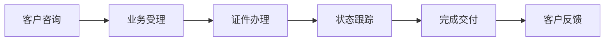
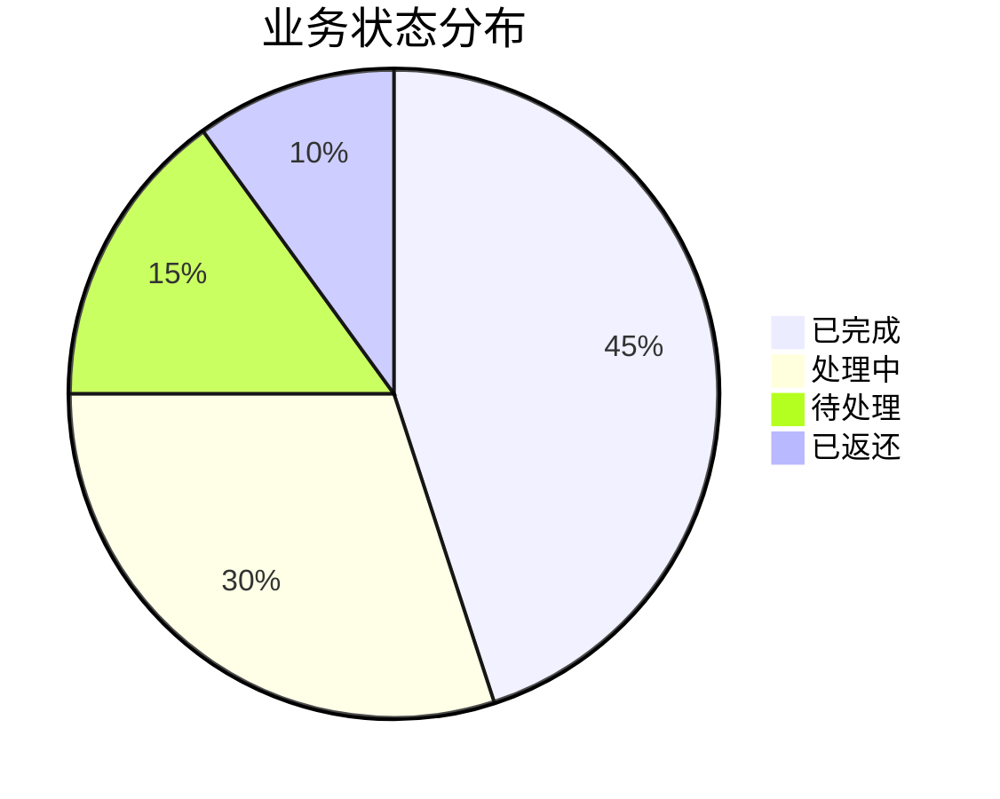
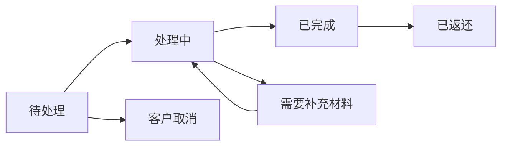
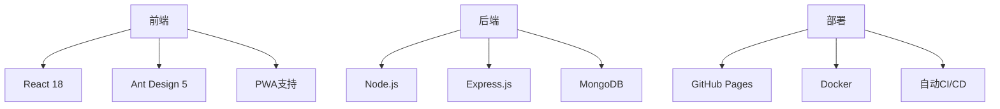

好的，我将为您提供使用 **GitPitch** 将Markdown转换为PPT的详细步骤。GitPitch是一个专门为开发者设计的工具，可以直接将GitHub仓库中的Markdown文件转换为漂亮的幻灯片。

---

# 🚀 使用GitPitch部署PPT的完整指南

## 步骤一：准备GitHub仓库

### 1. 创建新仓库
1. 登录您的GitHub账号
2. 点击右上角"+" → "New repository"
3. 填写仓库信息：
   - **Repository name**: `cambodia-doc-presentation` (或其他名称)
   - **Description**: `柬埔寨证件业务管理系统演示文稿`
   - **Public** (必须选择公开仓库)
   - **Initialize this repository with a README** ✅ (勾选此项)

### 2. 克隆仓库到本地
```bash
git clone https://github.com/你的用户名/cambodia-doc-presentation.git
cd cambodia-doc-presentation
```

---

## 步骤二：创建PPT配置文件

### 1. 创建PITCHME.md文件
在仓库根目录创建 `PITCHME.md` 文件，这是GitPitch的专用文件名。

将以下完整内容复制到 `PITCHME.md` 文件中：

```markdown
---
theme: default
background: https://images.unsplash.com/photo-1519389950473-47ba0277781c?ixlib=rb-4.0.3&ixid=M3wxMjA3fDB8MHxwaG90by1wYWdlfHx8fGVufDB8fHx8fA%3D%3D&auto=format&fit=crop&w=1740&q=80
class: text-center
highlighter: shiki
lineNumbers: false
info: |
  ## 柬埔寨证件业务管理系统
  多语言智能化证件管理解决方案
drawings:
  persist: false
transition: slide-left
title: 柬埔寨证件业务管理系统
---

# 🇰🇭 柬埔寨证件业务管理系统

## 多语言 · 智能化 · 全平台支持

<div class="pt-12">
  <span @click="$slidev.nav.next" class="px-2 py-1 rounded cursor-pointer" hover="bg-white bg-opacity-10">
    开始体验 <carbon:arrow-right class="inline"/>
  </span>
</div>

---

## 目录

- 📋 系统概述
- 🎯 核心功能
- 🛠️ 技术架构  
- 🌐 多语言支持
- 🚀 部署方案
- 💼 用户价值

---

## 系统概述

### 数字化转型的智能解决方案

- **🎯 目标**: 为柬埔寨证件业务提供全流程数字化管理
- **🌍 语言**: 完整支持中文、英文、柬文三语界面
- **📱 平台**: 网页版 + PWA移动端 + 桌面端
- **⚡ 特性**: 实时同步、离线支持、自动更新



---

## 登录界面


### 功能特点
- 🔐 安全的JWT身份认证
- 🌐 实时语言切换
- 📱 响应式设计
- 🔒 密码强度验证

**用户体验**: 30秒内完成登录流程

---

## 系统仪表板


### 核心指标
- **客户总数**: 1,248人
- **在办证件**: 356件
- **待处理**: 34件
- **本月完成**: 287件



---

## 客户管理


### 功能模块
- 👥 客户信息完整档案
- 🔍 智能搜索与筛选
- 📊 客户业务历史
- 📞 联系记录跟踪

**数据字段**: 姓名、护照号、联系方式、地址、备注

---

## 业务流程


### 状态流转


---

## 文件管理


### 支持功能
- 📤 多文件同时上传
- 👀 在线预览文档
- 📥 一键下载
- 🔄 版本控制
- 🗂️ 分类管理

**格式支持**: PDF, JPG, PNG, DOC, DOCX  
**大小限制**: 最大10MB/文件

---

## 移动端体验

<div style="display: flex; justify-content: center;">
  
</div>

### 移动特色
- 📱 添加到主屏幕
- 📷 拍照上传证件
- 📶 离线工作支持
- 🔔 推送通知提醒

**安装方式**: Safari → 分享 → 添加到主屏幕

---

## 多语言支持


### 语言特性
- 🌐 界面元素完全本地化
- ⚡ 实时切换无需刷新
- 💾 记住用户语言偏好
- 🎨 文化适配的UI设计

**翻译覆盖**: 100%界面元素 + 业务术语

---

## 技术架构

### 现代化技术栈



---

## 安全架构

### 多层次安全防护

- **🔐 身份认证**: JWT Token + 密码加密
- **🛡️ 数据安全**: HTTPS + 数据加密
- **📊 权限控制**: 角色基于权限管理系统
- **📝 操作审计**: 完整操作日志记录
- **🔄 自动备份**: 每日数据备份机制

---

## 部署方案

### 灵活部署选项

| 环境 | 推荐方案 | 特点 |
|------|----------|------|
| **开发** | Localhost | 快速迭代调试 |
| **测试** | GitHub Pages | 免费自动部署 |
| **生产** | VPS + Nginx | 高性能高可用 |

```bash
# 一键部署命令
npm run deploy
```

---

## 自动化工作流

### CI/CD流水线


**部署频率**: 每日多次，零停机更新

---

## 用户价值体现

### 业务效益提升

- **⏱️ 效率提升**: 减少70%手工操作
- **📋 错误减少**: 自动化验证防止错误
- **💼 客户满意**: 实时状态跟踪提升体验
- **📊 决策支持**: 数据驱动业务优化
- 💰 **成本节约**: 减少纸质文档使用

---

## 开始使用

### 三步快速上手

1. **🌐 访问系统**: 打开浏览器输入网址
2. **🔐 登录账户**: 使用管理员账号登录
3. **🎯 开始使用**: 添加客户和创建订单

```bash
# 演示账号
用户名: admin
密码: password
```

---

## 感谢观看

### 柬埔寨证件业务管理系统

**高效 · 安全 · 智能 · 多语言**

📧 联系邮箱: support@doc-system.com  
🌐 官方网站: https://doc-system.com  
📞 咨询电话: +855-12345678

---

## Q&A环节

### 问题与解答

🙋 欢迎提问任何关于系统的问题

⏰ 预计时间: 15分钟

📝 我们将记录所有问题并后续提供解答

---

## 下载链接

### 获取相关资源

- 📥 [完整用户手册](https://example.com/user-guide.pdf)
- 📥 [技术文档](https://example.com/tech-docs.pdf)
- 📥 [API参考](https://example.com/api-reference.pdf)
- 📥 [演示数据](https://example.com/demo-data.zip)

<div style="text-align: center;">
  
  <br>
  <small>扫描二维码获取最新信息</small>
</div>

---

# 谢谢！

## 期待与您合作

**数字化转型，从今天开始**
```

### 2. 创建配置文件 (可选)
创建 `PITCHME.yaml` 进行高级配置：

```yaml
theme: default
background: https://images.unsplash.com/photo-1519389950473-47ba0277781c?ixlib=rb-4.0.3&ixid=M3wxMjA3fDB8MHxwaG90by1wYWdlfHx8fGVufDB8fHx8fA%3D%3D&auto=format&fit=crop&w=1740&q=80
class: text-center
highlighter: shiki
lineNumbers: false
info: |
  ## 柬埔寨证件业务管理系统
  多语言智能化证件管理解决方案
drawings:
  persist: false
transition: slide-left
title: 柬埔寨证件业务管理系统
```

---

## 步骤三：推送代码到GitHub

### 1. 添加文件并提交
```bash
# 添加所有文件
git add .

# 提交更改
git commit -m "添加系统演示文稿"

# 推送到GitHub
git push origin main
```

### 2. 验证文件结构
推送完成后，您的仓库应该包含：
```
cambodia-doc-presentation/
├── PITCHME.md       # 主要演示文稿文件
├── PITCHME.yaml     # 配置文件（可选）
├── README.md        # 仓库说明文件
└── .gitignore       # Git忽略文件
```

---

## 步骤四：访问GitPitch演示文稿

### 1. 通过GitPitch访问
在浏览器中打开以下URL：
```
https://gitpitch.com/你的用户名/cambodia-doc-presentation
```

例如，如果您的用户名为 `johnsmith`，仓库名为 `cambodia-doc-presentation`，则访问：
```
https://gitpitch.com/johnsmith/cambodia-doc-presentation
```

### 2. 直接访问特定分支或标签
如果需要访问特定版本：
```
https://gitpitch.com/用户/仓库/分支名
https://gitpitch.com/用户/仓库/标签名
```

---

## 步骤五：演示文稿操作指南

### 键盘快捷键
- **空格键** 或 **→**: 下一张幻灯片
- **Shift+空格** 或 **←**: 上一张幻灯片
- **F**: 全屏模式
- **O**: 幻灯片概览
- **G**: 跳转到特定幻灯片

### 演讲者模式
- 在URL后添加 `?print` 进入打印模式
- 使用 `P` 键切换演讲者注释

---

## 步骤六：自定义和优化

### 1. 更换背景图片
在 `PITCHME.yaml` 中修改背景：
```yaml
background: https://images.unsplash.com/your-image-url.jpg
```

### 2. 添加自定义CSS
创建 `assets/css/custom.css`：
```css
/* 自定义样式 */
.slidev-layout {
  font-family: 'Your Font', sans-serif;
}

h1 {
  color: #1890ff;
}
```

在配置中引用：
```yaml
css: assets/css/custom.css
```

### 3. 添加公司Logo
在每页幻灯片底部添加Logo：
```markdown
---
footer: 您的公司名称 | © 2024
---
```

---

## 步骤七：分享和下载

### 1. 分享链接
直接将GitPitch URL分享给他人：
```
https://gitpitch.com/用户名/仓库名
```

### 2. 导出为PDF
1. 在GitPitch页面按 `P` 键
2. 选择"Print Slides"
3. 在浏览器中选择"另存为PDF"

### 3. 嵌入到网站
使用iframe嵌入：
```html
<iframe src="https://gitpitch.com/用户名/仓库名" 
        width="100%" 
        height="500px"
        frameborder="0">
</iframe>
```

---

## 故障排除

### 常见问题解决

1. **幻灯片不显示**
   - 确认仓库为Public
   - 确认PITCHME.md文件在根目录

2. **图片不显示**
   - 使用绝对URL而不是相对路径
   - 确认图片URL可公开访问

3. **样式不正常**
   - 检查PITCHME.yaml配置格式
   - 确认CSS文件路径正确

4. **Mermaid图表不渲染**
   - 等待GitPitch完全加载
   - 刷新页面重试

---

## 最佳实践

### 内容优化建议
1. **每张幻灯片一个主题**：保持内容聚焦
2. **使用高质量图片**：提升视觉效果
3. **代码示例简短**：突出关键部分
4. **充分利用Mermaid**：可视化复杂流程
5. **测试所有链接**：确保可访问性

### 性能优化
1. 压缩图片大小
2. 减少外部依赖
3. 使用CDN加速资源加载
4. 定期更新内容

---

现在您的演示文稿已经可以通过GitPitch访问了！任何人都可以通过您提供的URL查看专业的幻灯片演示。如果您需要进一步自定义或遇到任何问题，请随时告知。
